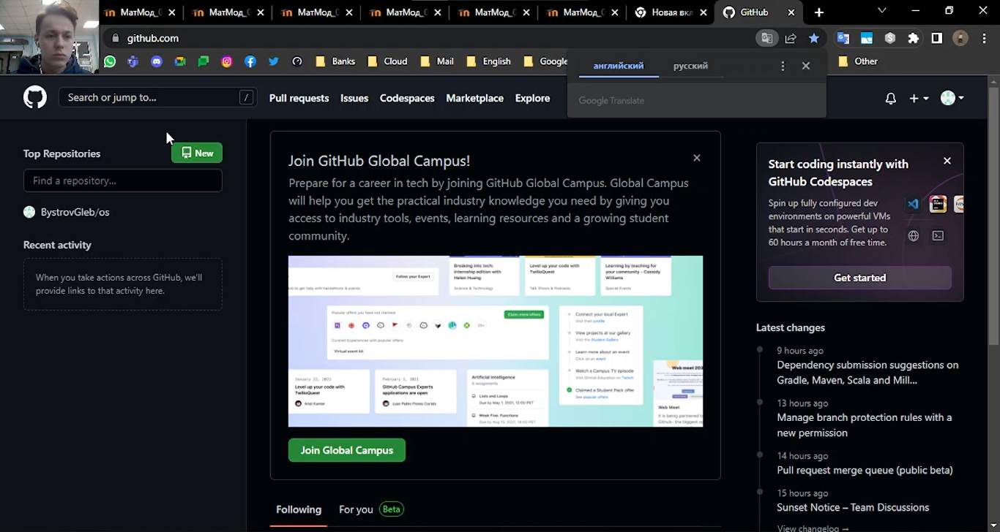
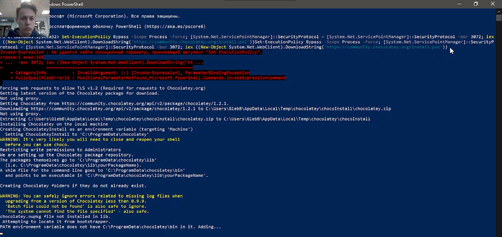
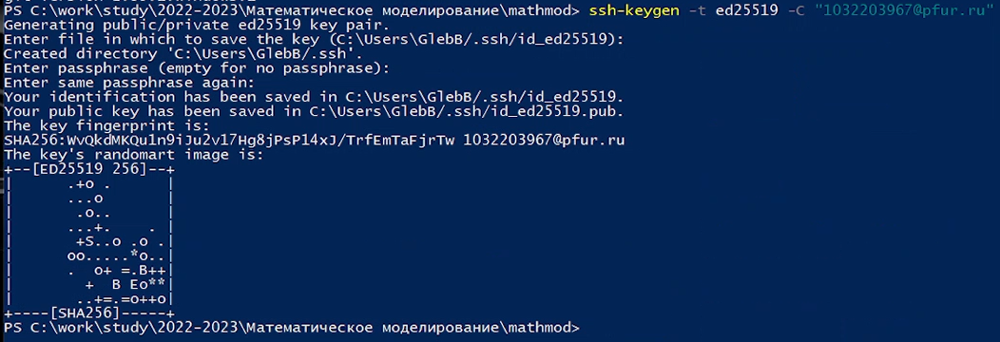
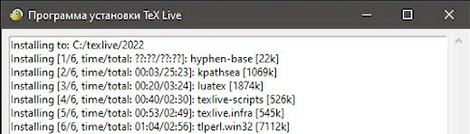
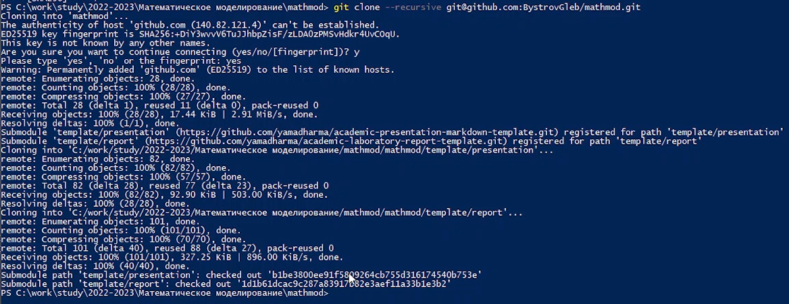
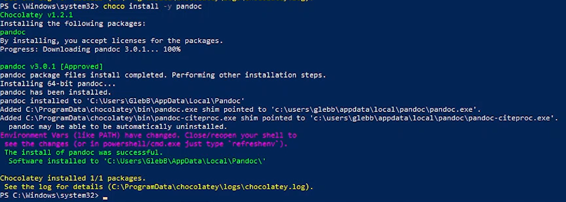
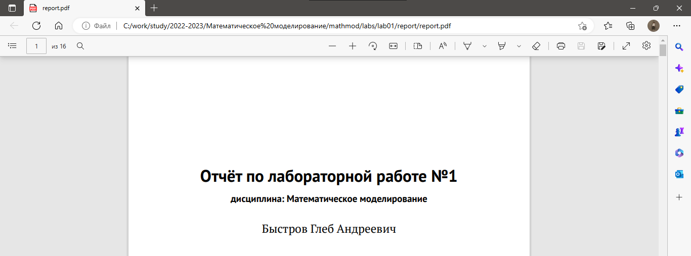
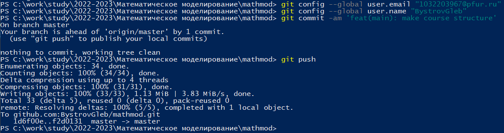
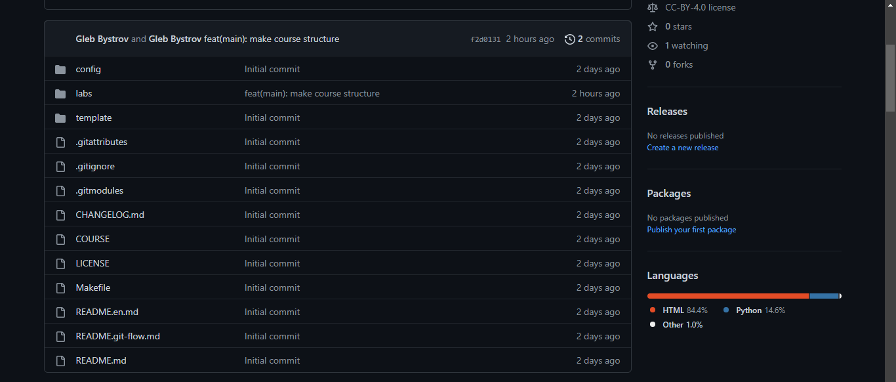

---
## Front matter
lang: ru-RU
title: Отчёт по лабораторной работе №1
author: |
	Быстров Г. А.
institute: |
	Российский университет дружбы народов, Москва, Россия
date: 11 февраля 2023

## Formatting
toc: false
slide_level: 2
theme: metropolis
header-includes: 
 - \metroset{progressbar=frametitle,sectionpage=progressbar,numbering=fraction}
 - '\makeatletter'
 - '\beamer@ignorenonframefalse'
 - '\makeatother'
aspectratio: 43
section-titles: true
---

## Прагматика

- научиться создавать и настроивать рабочее пространство для лабораторных работ;
- получить практические знания оформления отчётов с помощью легковесного языка разметки Markdown;
- решить возникающие трудности и проблемы;
- практически получить полезный результат.

## Цель работы

В данной лабораторной работе мне было необходимо вспомнить как работать с git и разметкой Markdown для формирования отчётов по лабораторным работам модифицируя готовый шаблон.

## Задачи

1. Создал каталоги со следующей структурой: ~/work/study/2022-2023/Математическое моделирование/mathmod/ (рис. \ref{1}).

{ width=70% }

## Задачи

2. Создал репозиторий на основе шаблона (рис. \ref{2}).

{ width=70% }

## Задачи

3. Запустил Windows PowerShell и установил менеджер пакетов с интерфейсом командной строки Chocolatey. Установил make и git (рис. \ref{3}).

{ width=70% }

## Задачи

4. Создал SSH-ключ и лобавил его на сайте https://github.com/  (рис. \ref{4}).

{ width=70% }

## Задачи

5. Создал рекурсивный клон репозитория используя команду в Windows PowerShell (рис. \ref{5}).

{ width=70% }

## Задачи

6. Установил универсальную утилиту для работы с текстовыми форматами Pandoc (рис. \ref{6}).

{ width=70% }

## Задачи

7. Установил TeX Live для генерации файлов в формат .pdf (рис. \ref{7}).

{ width=70% }

## Задачи

8. Ввел команду make для генерации отчета в двух форматах (рис. \ref{8}).

{ width=70% }

## Задачи

9. Отправил файлы на сервер, используя команды в Windows PowerShell (рис. \ref{9}).

{ width=70% }

## Задачи

10. Удостоверился, что данные в репозитории были обновлены (рис. \ref{10}).

{ width=70% }

## Результаты

- научился создавать и настроивать рабочее пространство для лабораторных работ;
- получил практические знания оформления отчётов с помощью легковесного языка разметки Markdown;
- вспомнил как работать с git и разметкой Markdown для формирования отчётов по лабораторным работам модифицируя готовый шаблон.